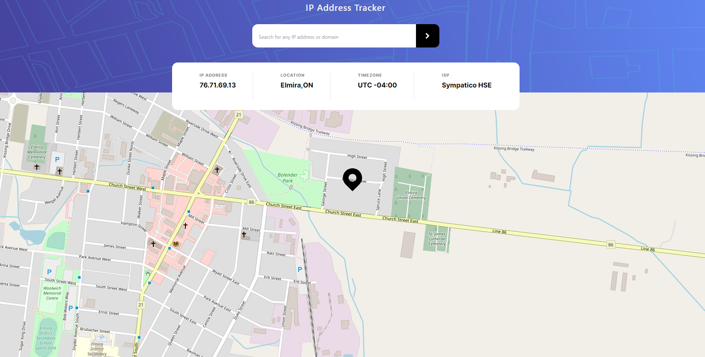

# IP Address Tracker APP 🌎

This project serves as a practical exercise in web development, designed for hands-on learning and skill honing. It leverages Next.js for seamless client-side routing, TypeScript for strong type checking, TailwindCSS for sleek and responsive design, Zustand for efficient state management, and custom hooks to enhance functionality.

At its core, this application is primarily an exercise in building real-world applications and gaining practical experience. It's designed to track and display IP information, providing a valuable tool for understanding network activity. While currently tailored for personal use, the project's main objective is to serve as a learning platform.

## Table of Contents

- [Getting Started](#getting-started)
- [Screenshot](#screenshot)
- [Built With](#built-with)

## Screenshot




### Built with

- Semantic HTML5 markup
- Zustand
- Custom Hooks 
- Mobile-first approach
- Responsive design
- [Next JS](https://nextjs.org/) - JS library
- [TypeScript](https://www.typescriptlang.org/)
- [TailwindCSS](https://tailwindcss.com/) - For styles
- [Vercel](https://vercel.com/) - Deployment
- [ipify API](https://www.ipify.org/)

## Getting Started

These instructions will help you get a copy of the project up and running on your local machine for development and testing purposes.

### Installation

1. Clone the repo
   ```sh
   git clone https://github.com/HpatricioH/ip-address-tracker

2. Change to the repo directory
   ```sh
   cd ip-address-tracker

3. Install NPM packages
   ```sh
   npm install

4. Start development server
   ```sh
    npm run dev 

